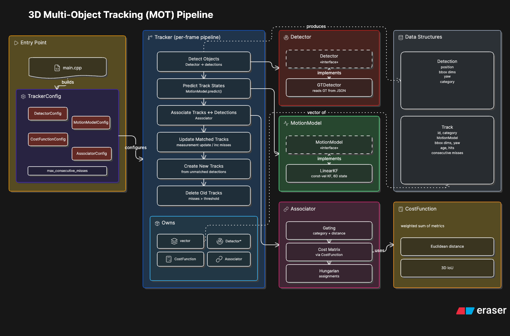

# 3D Multi-Object Tracking (MOT) Pipeline

A modular, config-driven 3D multi-object tracking system built in C++. Inspired by [SORT](https://arxiv.org/abs/1602.00763) and [AB3DMOT](https://arxiv.org/abs/2008.08063), this pipeline tracks objects across sequential frames using prediction, association, and track lifecycle management.

Designed from the ground up for **extensibility** — new detectors, motion models, cost functions, and gating strategies can be integrated without modifying the core tracker logic.

---

## Demo


---

## Architecture



The system follows a clean separation of concerns, with each component encapsulated in its own module behind a well-defined interface. The **Tracker** orchestrates a per-frame pipeline without knowing the internals of any component it drives.

### Per-Frame Pipeline

```
Frame N
  │
  ├── 1. Detect          ──  Fetch detections from the current frame
  ├── 2. Predict         ──  Propagate each track's state forward by dt
  ├── 3. Associate       ──  Match tracks to detections (cost matrix + Hungarian)
  ├── 4. Update          ──  Apply measurement update to matched tracks
  ├── 5. Create          ──  Initialize new tracks from unmatched detections
  └── 6. Delete          ──  Remove tracks exceeding consecutive miss threshold
```

### Module Overview

| Module | Responsibility |
|---|---|
| **Tracker** | Orchestrates the full per-frame pipeline. Owns all active tracks and delegates to each component. |
| **Scene** | Data structures representing a scene: frames, ego pose, sensor data paths, calibration, and annotations. Loaded once from a self-contained JSON file. |
| **Detector** | Abstract interface for producing detections from a Frame. Decouples the tracker from the data source. |
| **MotionModel** | Abstract interface for state estimation. Provides `predict()` and `update()` without exposing filter internals. |
| **CostFunction** | Computes a weighted combination of configurable cost metrics between a track and a detection. |
| **Associator** | Builds the cost matrix, applies gating rules, and solves the assignment problem via the Hungarian algorithm. |
| **Track** | Data structure representing a tracked object's identity, state, and lifecycle metadata. |
| **Detection** | Data structure representing a single detection: position, bounding box dimensions, yaw, and category. |

---

## Design Principles

### Pluggable Components via Abstract Interfaces

The **Detector** and **MotionModel** are defined as abstract base classes. Concrete implementations inherit from these interfaces and are injected into the Tracker at construction time. This means:

- Swapping ground-truth detections for a LiDAR detector requires **zero changes** to the Tracker or any other module.
- Replacing the Kalman Filter with an Unscented Kalman Filter or a learned motion model only requires implementing the `MotionModel` interface.

The Tracker uses a **factory pattern** for motion models — a callable that produces a new `MotionModel` instance given an initial position. This allows each track to own its own independent filter state.

### Modular Cost and Association

The cost function supports an arbitrary mix of cost types (e.g., Euclidean distance, 3D IoU), each with configurable weights. New cost metrics can be added by implementing a single method and registering the name — no changes to the Tracker, Associator, or any other module.

Gating logic lives in the Associator, separate from cost computation. Gating determines **eligibility** (should these two even be compared?), while the cost function determines **similarity** (how well do they match?). This separation keeps both components focused and independently extensible.

### Config-Driven Workflow

All tunable parameters are externalized to a JSON configuration file. The tracker binary reads its entire setup from config at startup — no recompilation needed to experiment with different parameter sets.

**Configurable parameters include:**
- Detector type and data source
- Motion model type
- Cost function types and their relative weights
- Distance gate for cost normalization
- Association gating thresholds
- Track deletion policy (max consecutive misses)

Each component defines its own **config struct** with sensible defaults. The top-level `TrackerConfig` composes all sub-configs, providing a single entry point for configuration while maintaining clear ownership of parameters.

---

## v1 Features

### Detection
- **Ground-truth 3D detections** loaded from nuScenes-format JSON scene files
- Supports position, bounding box dimensions (L x W x H), yaw, and category labels

### Motion Model
- **Constant-velocity linear Kalman Filter**
- 6D state vector: `[x, y, z, vx, vy, vz]`
- 3D measurement vector: `[x, y, z]`
- Timestamp-aware prediction with variable dt between frames

### Cost Function
- **Euclidean distance** (normalized by distance gate)
- **3D axis-aligned IoU** (converted to cost as `1 - IoU`)
- Weighted combination with configurable per-metric weights

### Association
- **Hungarian algorithm** for optimal bipartite matching
- **Category gating** — tracks and detections must share the same object class
- **Motion feasibility gating** — pairs are excluded if the object could not physically have moved from the predicted location to the detection in the elapsed time

### Track Management
- Automatic track creation from unmatched detections
- Automatic track deletion after exceeding a configurable consecutive miss threshold
- Per-track lifecycle metadata: age, hits, consecutive misses

---

## v2 Features

### Detection
- **PointPillars precomputed detections** — replaces ground-truth with real detector output
- Per-scene JSON files containing 3D detections with confidence scores
- Configurable score threshold for filtering low-confidence detections

### Association
- **Mahalanobis gating** — statistically-informed gating using the Kalman Filter's innovation covariance. The `MotionModel` interface exposes a `compute_innovation(z)` method that returns the innovation vector (y = z - Hx) and innovation covariance (S = HPH' + R), keeping filter internals encapsulated. Pairs exceeding a chi-squared threshold are excluded from association.

---

## Project Structure

```
Project_MOT/
├── include/                          # Header files
│   ├── types.hpp                     #   Common type aliases
│   ├── scene.hpp                     #   Scene, Frame, EgoPose, Calibration, Annotation structs
│   ├── detection.hpp                 #   Detection data structure
│   ├── track.hpp                     #   Track data structure
│   ├── detector.hpp                  #   Abstract detector interface + DetectorConfig
│   ├── gt_detector.hpp               #   Ground-truth detector implementation
│   ├── pointpillars_detector.hpp     #   PointPillars precomputed detector implementation
│   ├── motion_model.hpp              #   Abstract motion model interface + Innovation struct + MotionModelConfig
│   ├── linear_kf.hpp                 #   Linear Kalman Filter implementation
│   ├── cost_function.hpp             #   Cost computation + CostFunctionConfig
│   ├── associator.hpp                #   Track-detection association + AssociatorConfig
│   └── tracker.hpp                   #   Pipeline orchestrator + TrackerConfig
├── src/                              # Source files
│   ├── main.cpp                      #   Entry point: loads scenes, runs tracking loop
│   ├── tracker.cpp                   #   Tracker pipeline implementation
│   ├── track.cpp                     #   Track constructor
│   ├── gt_detector.cpp               #   Ground-truth detector (reads Frame annotations)
│   ├── pointpillars_detector.cpp     #   PointPillars detector (reads precomputed detections)
│   ├── linear_kf.cpp                 #   Kalman Filter predict/update + innovation computation
│   ├── cost_function.cpp             #   Distance and IoU cost implementations
│   └── associator.cpp                #   Cost matrix, gating, and Hungarian matching
├── scripts/                          # Python utilities
│   ├── export_scene_nuscenes.py      #   Export nuScenes data to scene JSON format
│   ├── export_gt_detections.py       #   Export GT detections (dataset-agnostic format)
│   ├── validate_gt_json.py           #   Validate legacy GT JSON files
│   ├── check_nuscenes.py             #   Verify nuScenes dataset mount
│   └── evaluate.py                   #   Evaluate tracking results via nuScenes devkit
├── configs/
│   ├── MOT_v1.json                   #   v1 configuration (GT detections)
│   └── MOT_v2.json                   #   v2 configuration (PointPillars detections)
├── models/
│   └── pointpillars/
│       └── precomputed_detections/   #   Per-scene PointPillars detection JSON files
├── results/
│   ├── scenes/                       #   Exported scene JSON files (input to tracker)
│   ├── gt/                           #   GT detection files (dataset-agnostic format)
│   └── tracking/                     #   Tracker output (timestamped run directories)
├── third_party/
│   └── hungarian-algorithm-cpp/      #   Vendored Hungarian algorithm library
└── CMakeLists.txt                    #   Build configuration
```

---

## Dependencies

- **C++17** or later
- **Eigen** — Linear algebra (state vectors, matrices)
- **nlohmann/json** — JSON configuration and data parsing
- **Hungarian algorithm** — Vendored from [mcximing/hungarian-algorithm-cpp](https://github.com/mcximing/hungarian-algorithm-cpp)

---

## Build and Run

```bash
cd Project_MOT
mkdir build && cd build
cmake ..
make
./mot_tracker
```

The tracker reads its configuration from `../configs/MOT_v2.json` by default. To run with ground-truth detections, change the config path in `main.cpp` to `../configs/MOT_v1.json`.

---

## Visualization

For interactive 3D visualization of tracking results (LiDAR point clouds, 3D bounding boxes, and multi-camera views), see [SensorLens](https://github.com/nairb36/SensorLens).

---

## Data Preparation

### nuScenes Sanity Check

Verify that the nuScenes dataset is correctly mounted and accessible:

```bash
python3 scripts/check_nuscenes.py \
    --dataroot /data/nuscenes \
    --version  v1.0-mini
```

### Export Scene Files

Export nuScenes data into self-contained scene JSON files. Each file includes per-frame ego pose, sensor data paths, calibration, and ground-truth annotations.

Export a single scene:

```bash
python3 scripts/export_scene_nuscenes.py --scene-index 0
```

Export all scenes:

```bash
python3 scripts/export_scene_nuscenes.py --all
```

Output goes to `results/scenes/` by default.

### Export GT Detections

A dataset-agnostic flat-array GT format used by [SensorLens](https://github.com/nairb36/SensorLens) and evaluation tooling. Each dataset gets its own export script (`export_gt_detections.py` for nuScenes, future `export_gt_waymo.py` for Waymo, etc.) that produces the same canonical format.

```bash
python3 scripts/export_gt_detections.py \
    --scene-index 0 \
    --output results/gt/scene_0000.json
```

---

## Evaluation

Tracking results are evaluated against the nuScenes tracking benchmark using the official `nuscenes-devkit`. The evaluation computes standard multi-object tracking metrics across 7 classes (bicycle, bus, car, motorcycle, pedestrian, trailer, truck).

### Metrics

| Metric | Description |
|---|---|
| **AMOTA** | Average Multi-Object Tracking Accuracy — primary nuScenes metric. Averages MOTA across 40 recall thresholds using `tracking_score`. |
| **AMOTP** | Average Multi-Object Tracking Precision — averaged MOTP across recall thresholds. |
| **MOTA** | Multi-Object Tracking Accuracy — accounts for false positives, false negatives, and identity switches. |
| **MOTP** | Multi-Object Tracking Precision — average localization error of matched detections (lower is better). |
| **MOTAR** | Modified MOTA at measured recall. |
| **IDS** | Number of identity switches. |
| **FRAG** | Number of track fragmentations. |
| **TID** | Track Initialization Duration — average time from first GT appearance to first correct detection. |
| **LGD** | Longest Gap Duration — average longest gap in continuous tracking. |
| **MT / ML** | Mostly Tracked / Mostly Lost track counts. |

### Running Evaluation

After running the tracker, pass the timestamped results directory to the evaluation script:

```bash
python3 scripts/evaluate.py results/tracking/20260515_232920
```

The script auto-detects which scenes belong to `mini_val` and `mini_train`, converts tracker output to nuScenes submission format, and runs the official `TrackingEval` for each split.

### v1 Results (nuScenes mini)

| Split | AMOTA | AMOTP | MOTA | MOTP | Recall | IDS | FRAG |
|---|---|---|---|---|---|---|---|
| mini_val (2 scenes) | 0.879 | 0.047 | 0.885 | 0.014 | 1.000 | 116 | 3 |
| mini_train (8 scenes) | 0.911 | 0.083 | 0.922 | 0.027 | 0.989 | 121 | 33 |

---

### Scene JSON Format

Each scene file is a self-contained JSON document with the following structure:

```json
{
  "scene_name": "scene-0061",
  "description": "...",
  "log_token": "...",
  "num_frames": 39,
  "calibration": {
    "LIDAR_TOP": {
      "extrinsic": {
        "translation": [x, y, z],
        "rotation": [w, x, y, z]
      }
    },
    "CAM_FRONT": { "extrinsic": { "..." } }
  },
  "frames": [
    {
      "frame_id": 0,
      "sample_token": "...",
      "timestamp": 1532402927647951,
      "ego_pose": {
        "translation": [x, y, z],
        "rotation": [w, x, y, z]
      },
      "sensor_data": {
        "LIDAR_TOP": { "file": "samples/LIDAR_TOP/..." },
        "CAM_FRONT": { "file": "samples/CAM_FRONT/..." }
      },
      "annotations": [
        {
          "instance_token": "...",
          "category_name": "vehicle.car",
          "translation": [x, y, z],
          "size": [l, w, h],
          "rotation": [w, x, y, z],
          "yaw": 1.234
        }
      ]
    }
  ]
}
```
